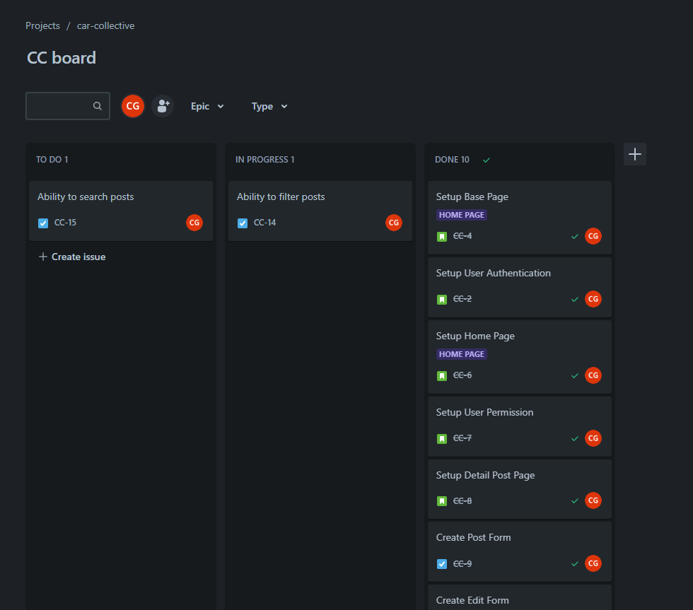
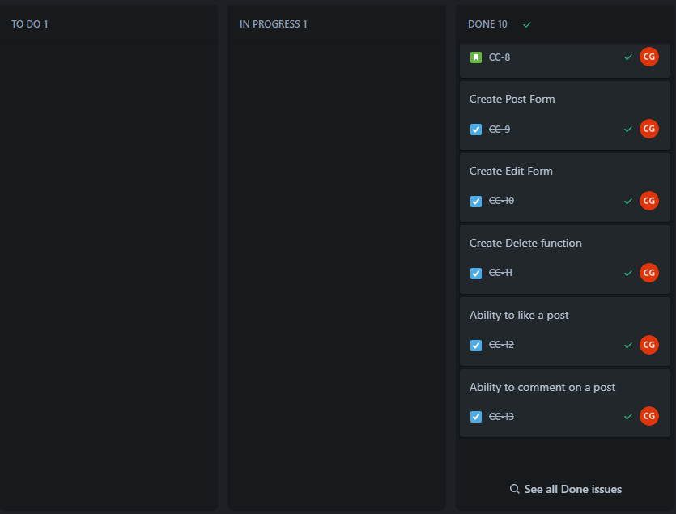
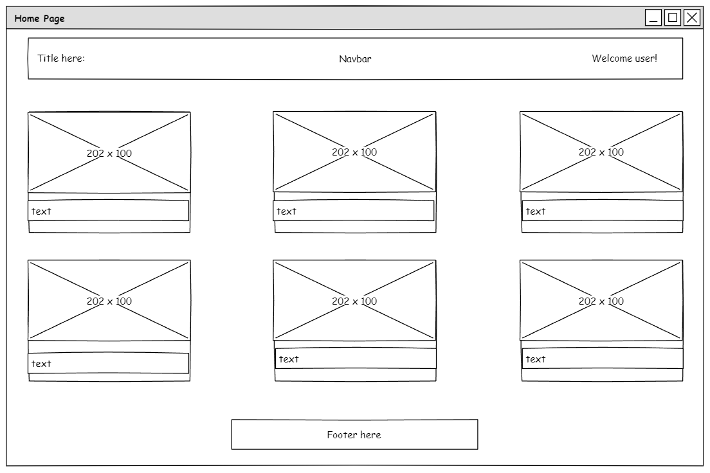
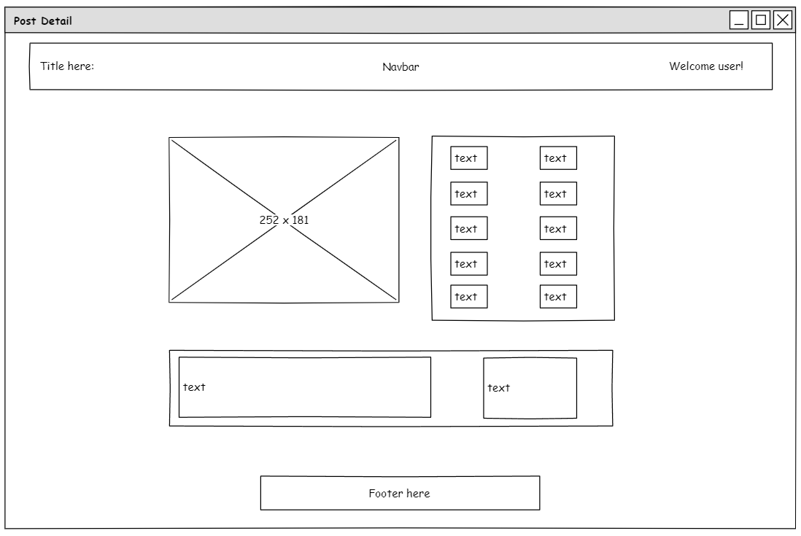
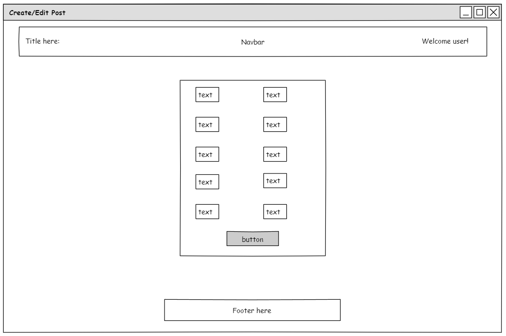
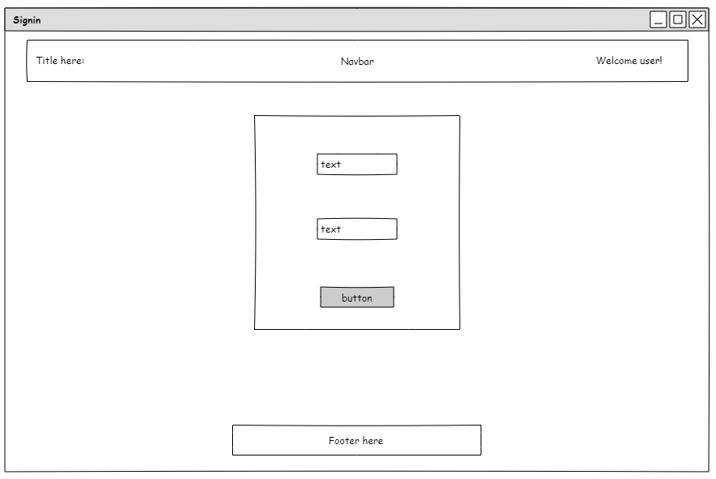
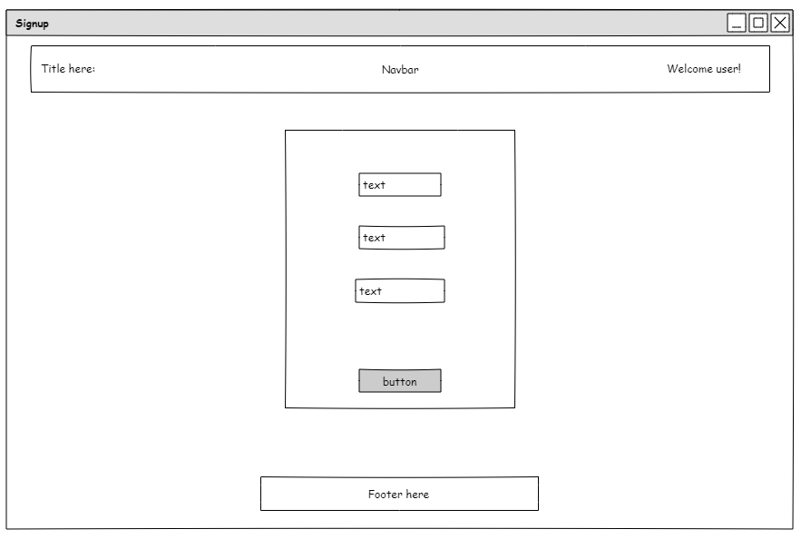
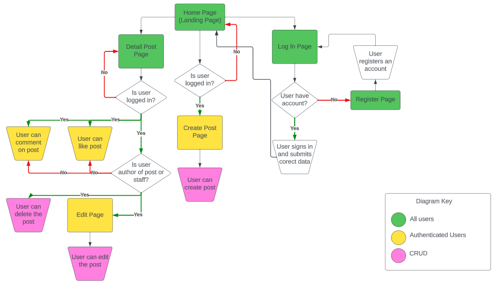
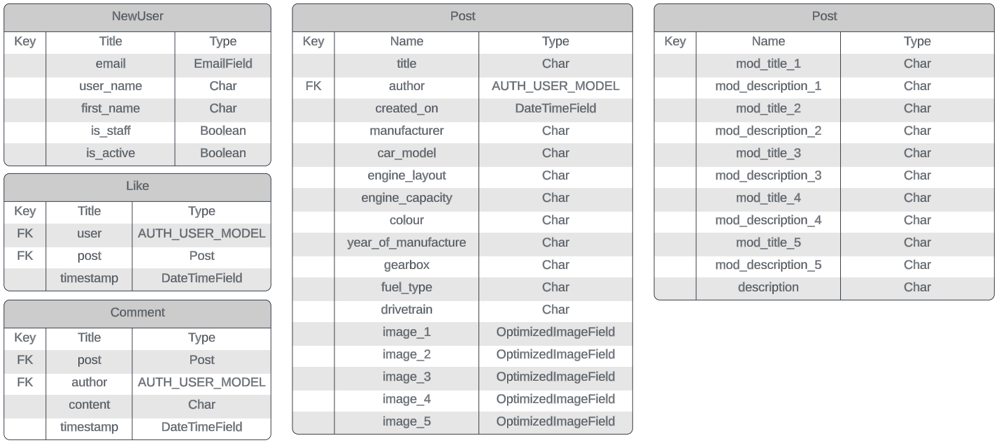
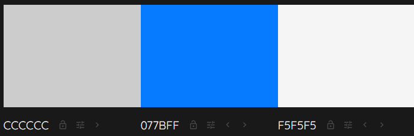

# Car-Collective

Car-Collective is a site for car enthusiasts to come together and post their cars, and interact with other posts from like minded people.

## Live Site

[Car-Collective](https://car-collective-8debc1088dd6.herokuapp.com/)

## Contents

- [User Experiences](#user-experence)
  - [User Stories]("user-stories)
  - [Agile Methodology](#agile-methodology)
  - [Wireframes](#wireframes)
  - [Database](#database)
  - [Color Scheme](#color-scheme)
- [Features](#features)
  - [Existing Features](#existing-features)
  - [Future Features](#future-features)
- [Technologies](#technologies)
  - [Languages & Frameworks](#languages-and-frameworks)
  - [Other](#other)
- [Testing](#testing)

## **User Experiences**

### **User Stories**

- User Authentication

  - As a user I can create a new account
  - As a user I can sign into an existing account
  - As a user I can logout of my account

- Navigation

  - As a user I can view the navbar from every page
  - As a user I can view the footer from every page
  - As a user I can access further areas if I am authenticated/authorized

- Home Page

  - As a user I can view all posts from the database
  - As a user I can see the amount of likes on a post
  - As a user I can select a post to view more details

- Post Detail Page

  - As a user I can view all data from the post
  - As an authenticated user I can like the post
  - As an authenticated user I can comment on the post

- Posts
  - As an authenticated user I can create new posts
  - As an authenticated user I can edit my own posts
  - As an authenticated user I can delete my own posts
  - As a staff user I can edit edit any post
  - As a staff user I can delete edit any post

[Back to top](#contents)

### **Agile Methodology**

This project utulised Agile Methodolgy for development. I used Jira to track my tickets:

[Back to top](#contents)

### **Wireframes**

Wireframes were created using [Pencil](https://pencil.evolus.vn/). These were initial rough ideas of the site structure and layout.

[Back to top](#contents)

### **Database**

I used [Lucid chart](https://lucidchart.com/pages/) to create a data flow diagram showing what an authorized and non-authorized user had access to throughout the site. I have also shown below my custom models for User, Post, Like and Comment.

[Back to top](#contents)

### **Color Scheme**

Main colours used throughout are listed below. I came across the blue color previously and liked it a lot. I used a basic light grey and white background to go with the blue in some areas, to make a clean and simple design. I prefer less colours as it can begin to look unorganised if too many are used.

[Back to top](#contents)
