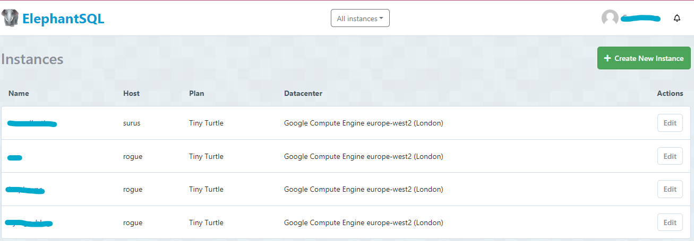

# Car-Collective

Car-Collective is a site for car enthusiasts to come together and post their cars, and interact with other posts from like minded people.

## Live Site

[Car-Collective](https://car-collective-8debc1088dd6.herokuapp.com/)

## Grade
Grade PASS

## Contents

- [User Experiences](#user-experence)
  - [User Stories]("user-stories)
  - [Agile Methodology](#agile-methodology)
  - [Wireframes](#wireframes)
  - [Database](#database)
  - [Color Scheme](#color-scheme)
- [Features](#features)
  - [Existing Features](#existing-features)
  - [Future Features](#future-features)
- [Technologies](#technologies)
  - [Languages & Frameworks](#languages-and-frameworks)
  - [Other](#other)
- [Testing](#testing)
- [Deployment](#deployment)
  - [Database](#database)
  - [Heroku](#heroku)
  - [Cloudinary](#cloudinary)
  - [Forking](#forking)
  - [Cloning](#cloning)
- [Credits](#credits)

### Project Goals
In this project I want to create a simple to use, basic social media app. Where users can upload posts and others can interact with those posts.  I want to become more familar with React during this project.

## **User Experiences**

### **User Stories**

- User Authentication

  - As a user I can create a new account
  - As a user I can sign into an existing account
  - As a user I can logout of my account

- Navigation

  - As a user I can view the navbar from every page
  - As a user I can view the footer from every page
  - As a user I can access further areas if I am authenticated/authorized

- Home Page

  - As a user I can view all posts from the database
  - As a user I can see the amount of likes on a post
  - As a user I can select a post to view more details

- Post Detail Page

  - As a user I can view all data from the post
  - As an authenticated user I can like the post
  - As an authenticated user I can comment on the post

- Posts
  - As an authenticated user I can create new posts
  - As an authenticated user I can edit my own posts
  - As an authenticated user I can delete my own posts
  - As a staff user I can edit edit any post
  - As a staff user I can delete edit any post

[Back to top](#contents)

### **Agile Methodology**

This project utulised Agile Methodolgy for development. I used Jira to track my tickets:

[Back to top](#contents)

### **Wireframes**

Wireframes were created using [Pencil](https://pencil.evolus.vn/). These were initial rough ideas of the site structure and layout.

[Back to top](#contents)

### **Database**

I used [Lucid chart](https://lucidchart.com/pages/) to create a data flow diagram showing what an authorized and non-authorized user had access to throughout the site. I have also shown below my custom models for User, Post, Like and Comment.

[Back to top](#contents)

### **Color Scheme**

Main colours used throughout are listed below. I came across the blue color previously and liked it a lot. I used a basic light grey and white background to go with the blue in some areas, to make a clean and simple design. I prefer less colours as it can begin to look unorganised if too many are used.

[Back to top](#contents)

## **Features**

### **Existing Features**

### Navbar

- The nav bar is featured on all pages of the site
- Car Collective will take you back to the home screen
- If user is loged in Create Post will appear and take them to the create post form
- If user logged in their name will appear in top right with a dropdown, within they can logout
- If user is not logged in there will be a log in option instead
- Fully responsive thanks to bootstrap, it collapses for mobile and tablet use

[Back to top](#contents)

### Post Card

- This is how all posts will be displayed on the home page
- Image 1 from the model is displayed
- Title and author displayed at top
- Make, manufacturer and year of manufacture underneath
- Number of likes also shows
- Card changes when hovering

[Back to top](#contents)

### Pagiantion

- Displays at bottom of container
- Current page is indicated by blue fill

[Back to top](#contents)

### Social Footer

- Social icons displayed in footer
- Each icon is linked to the given media platform
- My GitHub profile is also displayed here

[Back to top](#contents)

### Create Post Form

- User can input data relevant to their car here
- Some of these fields are dropdowns with pre-determined items
- User can add optional mods to their post if desired
- Additional images can be added
- All main fields and one image must be included in post

[Back to top](#contents)

### Post Detail View

- User will be shown an automatic slideshow of any pictures uploaded, they can also select the image to see it in a larger format
- The post data is displayed to the right of the slideshow
- Description is displayed underneath the post data
- If user is logged in and is either staff or author of the post, they will be able edit and delete the post from here

[Back to top](#contents)

### Comments

- User will see all comments relating to the post here
- If user is logged in and authenticated they will have the ability to add a comment here

[Back to top](#contents)

### Likes

- User will see a tally of all likes relevant to this post
- If user is logged in and authenticated they will have the ability to like the post

[Back to top](#contents)

### Edit Post

- User will see existing data which they uploaded when initially creating the post
- Data can be replaced with what ever the user choices

[Back to top](#contents)

### Delete Post

- If user is author of post or staff, they will have this option
- A modal pops up warning and confirming what they are doing

[Back to top](#contents)

### Login Page

- User be shown simple form requesting email and password
- If user doesnt have account they have the option to create one

[Back to top](#contents)

### Register page

- User shown simple form requesting data to be filled in to create an account

[Back to top](#contents)

### **Future Features**

- Add a filter function on the home page
- Add a search function on the home page
- Email authentication:
  - Confirmation email with a code to enter
  - Passwords being resetable
- Staff, Author of post and author of comment to be able to delete comment from UI. This can only be done via Django admin screen

[Back to top](#contents)

## **Technologies**

### **Languages and Frameworks**

- [JavaScript](https://www.javascript.com/)
- [JSX](https://react.dev/)
- [React Bootstrap](https://react-bootstrap.github.io/)
- [Python](https://www.python.org/)
- [Django](https://www.djangoproject.com/)
- [HTML5](https://en.wikipedia.org/wiki/HTML5)
- [CSS3](https://en.wikipedia.org/wiki/CSS)

### **Other**

- [ElephantSQL](https://www.elephantsql.com/) was used as the postgres, database system
- [Font Awesome](https://fontawesome.com/) was used to provide a few icons
- [Heroku](https://www.heroku.com/home?) was used to host my deployed project
- [TinyPNG](https://tinypng.com/) was used to decrease size of uploaded files
- [Pencil](https://pencil.evolus.vn/) was used to make my wireframes
- [Lucidchart](https://www.lucidchart.com/pages/) was used to make my data flow diagram and model diagram

[Back to top](#contents)

## **Testing**

The app was tested during and after development. Results can be found [here](TESTING.md).  Known issues are listed within here.

[Back to top](#contents)

## **Deployment**

### **Database**

To create a managed postgres database go to [ElephantSQL](https://www.elephantsql.com/) and Sign Up / Login.

- Click on 'Create new instance'

- Name your database, choose the 'Tiny Turtle' plan and click 'Select Region'

- Choose your region and then create the database. instance.
- In the instances page, click the name of your chosen database.
- In the details section of the following page copy the postgres url.

You can now use this URL when linking the database to the project repository.

[Back to top](#contents)

### **Heroku**

- Sign Up / Login to Heroku
  - Create a new app from the Heroku dashboard

- Give the app a unique name and enter the region of operation then click 'create app'.
- From your newly created app choose the settings tab and navigate to 'Reveal Config Vars'.
- Paste the ElephantSQL Database url into the DATABASE_URL environment variable.

- Create an env.py file in the root directory of your Django project (at the same directory level as requirements.txt and manage.py). Once created add the filename to .gitignore as it stores sensitive info.

- Paste the ElephantSQL url for the DATABASE_URL value.
- Add the following libraries to the settings.py file: Import Path from pathlib, dj_database_url and os.

- Create a secret key to replace the insecure SECRET_KEY variable in the settings.py file. Link the secure key in env.py to the settings.py SECRET_KEY variable with the following code: SECRET_KEY = os.environ.get('SECRET_KEY')
- Add your secret key to HEROKU Config Vars.
- Link the DATABASES value to the env.py file with the following code: DATABASES = { 'default': dj_database_url.parse(os.environ.get('DATABASE_URL')) }
- You can now migrate the app models to the new database using the command: "python3 manage.py makemigrations" then Python3 manage.py migrate.

[Back to top](#contents)

## **Cloudinary**

- Signup/Signin to Cloudinary
- Copy the 'cloudinary url' from your account dashboard and paste it as the CLOUDINARY_URL value in env.py.
- Add the CLOUDINARY_URL to the Config Vars in Heroku.
- Also Add the DISABLE_COLLECTSTATIC Key with the value of 1
- Change the static file settings in Django by altering the following.
- The STATIC_URL
- STATICFILES_STORAGE
- STATICFILES_DIRS
- STATIC_ROOT
- MEDIA URL
- DEFAULT_FILE_STORAGE

The STATIC section of settings.py should resemble the following image:

- Change the TEMPLATES 'DIRS' Setting in Settings.py to [TEMPLATES_DIR] TEMPLATES configuration for the project should resemble the following image:

- Back nearer the top of the settings.py file add the Setting TEMPLATES_DIR = os.path.join(BASE_DIR, 'templates')
- Create 3 new folders for static files, media files and HTML templates. (At the same directory level as requirements.txt and manage.py.)
- Create a Procfile(capital P) and add the following: web: gunicorn NAME_OF_THE_APP_GOES_HERE.wsgi
- Add the app name and herokuapp.com to the list of ALLOWED_HOSTS.
- Add and commit the changes to GitHub.
- Remove DISABLE_COLLECTSTATIC from Heroku Config Vars
- Deploy via the 'Deploy Main Branch' button in the Deployment page of HEROKU.
- If you receive an success message, you can click the link provided to view the app in the web browser.

[Back to top](#contents)

## **Forking**

- Sign up / Login to GitHub
- Follow this link to my repo - https://github.com/camerong-dev/inspire-pc
- Click on the 'Fork' button near top-right of the screen.
- A copy of my repository should now be availble in your list of GitHub repos

[Back to top](#contents)

## **Cloning**

- Sign Up / Login to GitHub
- Follow this link to the MyPSE.ie repository: https://github.com/camerong-dev/inspire-pc
- Click on the <> Code button near the top-right of the page.
- Access the 'Code' menu from above the main directory window and choose a preferred cloning option by selecting either HTTPS or GitHub CLI. An SSH key is required should you prefer that option.
- Press the overlapping squares icon to copy the link to the repository.
- Open the code editor of your choice.
- Create a new working directory for the cloned repo.
- Use the 'git clone command and paste in the copied link.
- Press enter and the repo will be cloned locally to your machine.
- Setup and activate your local development environment.
- Install the project requirements using the command -- pip3 install -r requirements.txt
- Create a Heroku app for your Clone and add the appropriate Config Vars using the instructions above.
- Create an env.py file that includes the appropriate DATABSE_URL, SECRET_KEY and CLOUDINARY_URL settings.
- Add 'localhost' to ALLOWED_HOSTS in settings.py
- Use the command -- python3 manage.py makemigrations followed by -- python3 manage.py migrate to setup a local copy of the project database.
- Use the command python3 manage.py runserver to run the app on a development server.

[Back to top](#contents)

## **Credits**

- Navbar is a modified version of bootstrap's responsive nav bar, which can be found [here](https://react-bootstrap.github.io/docs/components/navbar#responsive-behaviors)
- The home page uses bootstraps 'kitchen sink' which have been modified, can be found [here](https://react-bootstrap.github.io/docs/components/cards#kitchen-sink)
- [FontAwesome](https://fontawesome.com/) for the icons I used
- To setup my custom user model I used this [video](https://www.youtube.com/watch?v=Ae7nc1EGv-A&t=297s)
- To get me going with my Permissions i used this [video](https://www.youtube.com/watch?v=5AOn0BmSXyE&list=PLOLrQ9Pn6caw0PjVwymNc64NkUNbZlhFw&index=2&t=1928s)
- Colleagues at work helping me debug issues and give solutions where needed

- Utulized the CI walkthrough project 'Moments' as a very loose guide
- [React Docs 1](https://www.w3schools.com/react/)
- [React Docs 2](https://www.freecodecamp.org/news/the-react-handbook-b71c27b0a795/)
- [JavaScript](https://www.w3schools.com/Js/)
- [JSX](https://www.w3schools.com/react/react_jsx.asp)
- [Django Rest Framework](https://www.django-rest-framework.org/)
- [Django](https://docs.djangoproject.com/en/4.2/)
