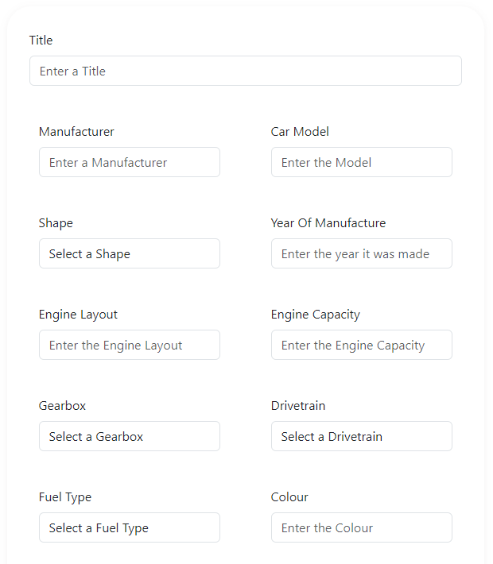

# Car-Collective

Car-Collective is a site for car enthusiasts to come together and post their cars, and interact with other posts from like minded people.

## Live Site

[Car-Collective](https://car-collective-8debc1088dd6.herokuapp.com/)

## Contents

- [User Experiences](#user-experence)
  - [User Stories]("user-stories)
  - [Agile Methodology](#agile-methodology)
  - [Wireframes](#wireframes)
  - [Database](#database)
  - [Color Scheme](#color-scheme)
- [Features](#features)
  - [Existing Features](#existing-features)
  - [Future Features](#future-features)
- [Technologies](#technologies)
  - [Languages & Frameworks](#languages-and-frameworks)
  - [Other](#other)
- [Testing](#testing)

## **User Experiences**

### **User Stories**

- User Authentication

  - As a user I can create a new account
  - As a user I can sign into an existing account
  - As a user I can logout of my account

- Navigation

  - As a user I can view the navbar from every page
  - As a user I can view the footer from every page
  - As a user I can access further areas if I am authenticated/authorized

- Home Page

  - As a user I can view all posts from the database
  - As a user I can see the amount of likes on a post
  - As a user I can select a post to view more details

- Post Detail Page

  - As a user I can view all data from the post
  - As an authenticated user I can like the post
  - As an authenticated user I can comment on the post

- Posts
  - As an authenticated user I can create new posts
  - As an authenticated user I can edit my own posts
  - As an authenticated user I can delete my own posts
  - As a staff user I can edit edit any post
  - As a staff user I can delete edit any post

[Back to top](#contents)

### **Agile Methodology**

This project utulised Agile Methodolgy for development. I used Jira to track my tickets:

[Back to top](#contents)

### **Wireframes**

Wireframes were created using [Pencil](https://pencil.evolus.vn/). These were initial rough ideas of the site structure and layout.

[Back to top](#contents)

### **Database**

I used [Lucid chart](https://lucidchart.com/pages/) to create a data flow diagram showing what an authorized and non-authorized user had access to throughout the site. I have also shown below my custom models for User, Post, Like and Comment.

[Back to top](#contents)

### **Color Scheme**

Main colours used throughout are listed below. I came across the blue color previously and liked it a lot. I used a basic light grey and white background to go with the blue in some areas, to make a clean and simple design. I prefer less colours as it can begin to look unorganised if too many are used.

[Back to top](#contents)

## **Features**

### **Existing Features**

### Navbar

- The nav bar is featured on all pages of the site
- Car Collective will take you back to the home screen
- If user is loged in Create Post will appear and take them to the create post form
- If user logged in their name will appear in top right with a dropdown, within they can logout
- If user is not logged in there will be a log in option instead
- Fully responsive thanks to bootstrap, it collapses for mobile and tablet use

[Back to top](#contents)

### Post Card

- This is how all posts will be displayed on the home page
- Image 1 from the model is displayed
- Title and author displayed at top
- Make, manufacturer and year of manufacture underneath
- Number of likes also shows
- Card changes when hovering

[Back to top](#contents)

### Pagiantion

- Displays at bottom of container
- Current page is indicated by blue fill

[Back to top](#contents)

### Social Footer

- Social icons displayed in footer
- Each icon is linked to the given media platform
- My GitHub profile is also displayed here

[Back to top](#contents)

### Create Post Form

- User can input data relevant to their car here
- Some of these fields are dropdowns with pre-determined items
- User can add optional mods to their post if desired
- Additional images can be added
- All main fields and one image must be included in post

[Back to top](#contents)

### Post Detail View

- User will be shown an automatic slideshow of any pictures uploaded, they can also select the image to see it in a larger format
- The post data is displayed to the right of the slideshow
- Description is displayed underneath the post data
- If user is logged in and is either staff or author of the post, they will be able edit and delete the post from here

[Back to top](#contents)

### Comments

- User will see all comments relating to the post here
- If user is logged in and authenticated they will have the ability to add a comment here

[Back to top](#contents)

### Likes

- User will see a tally of all likes relevant to this post
- If user is logged in and authenticated they will have the ability to like the post

[Back to top](#contents)

### Edit Post

- User will see existing data which they uploaded when initially creating the post
- Data can be replaced with what ever the user choices

[Back to top](#contents)

### Delete Post

- If user is author of post or staff, they will have this option
- A modal pops up warning and confirming what they are doing

[Back to top](#contents)

### Login Page

- User be shown simple form requesting email and password
- If user doesnt have account they have the option to create one

[Back to top](#contents)

### Register page

- User shown simple form requesting data to be filled in to create an account

[Back to top](#contents)

### **Future Features**

- Add a filter function on the home page
- Add a search function on the home page
- Email authentication:
  - Confirmation email with a code to enter
  - Passwords being resetable
- Staff, Author of post and author of comment to be able to delete comment from UI. This can only be done via Django admin screen

[Back to top](#contents)

## **Technologies**

### **Languages and Frameworks**

- [JavaScript](https://www.javascript.com/)
- [JSX](https://react.dev/)
- [React Bootstrap](https://react-bootstrap.github.io/)
- [Python](https://www.python.org/)
- [Django](https://www.djangoproject.com/)
- [HTML5](https://en.wikipedia.org/wiki/HTML5)
- [CSS3](https://en.wikipedia.org/wiki/CSS)

### **Other**

- [ElephantSQL](https://www.elephantsql.com/) was used as the postgres, database system
- [Font Awesome](https://fontawesome.com/) was used to provide a few icons
- [Heroku](https://www.heroku.com/home?) was used to host my deployed project
- [TinyPNG](https://tinypng.com/) was used to decrease size of uploaded files
- [Pencil](https://pencil.evolus.vn/) was used to make my wireframes
- [Lucidchart](https://www.lucidchart.com/pages/) was used to make my data flow diagram and model diagram
